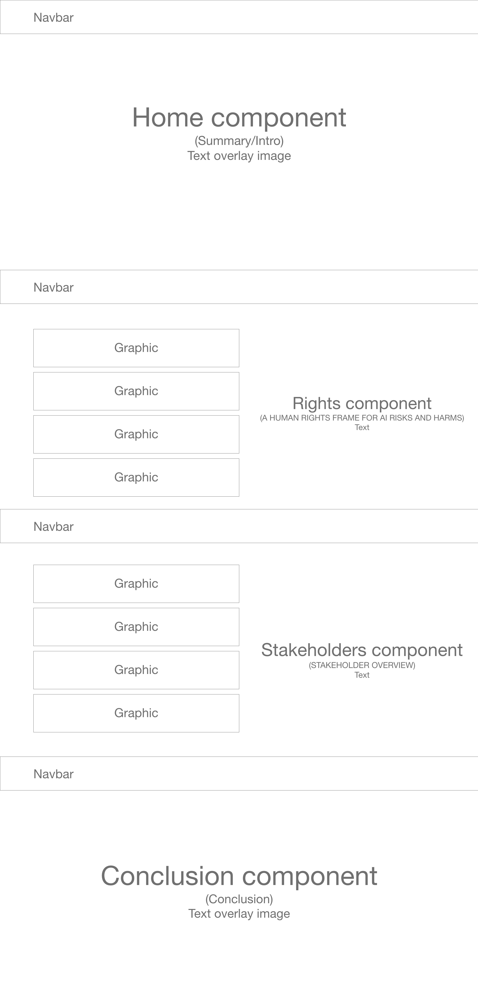

# industry-reports

## Teammates

Rafael - Team Leader, managing pull request, Stakeholder component

Denisse - Navbar and Routing

Deji - Introduction and Conclusion components

Walter - Wireframe, README, and Rights component

## What is the purpose of the website

To convey portions this report:

Governing Artificial Intelligence:
UPHOLDING HUMAN RIGHTS & DIGNITY
by
Mark Latonero

## Brief description of the report

>This report is intended as a resource for anyone working in the field of AI and governance. It is also intended for those in the human rights field, outlining why they should be concerned about the present-day impacts of AI. What follows translates between these fields by reframing the societal impact of AI systems through the lens of human rights. As a starting point, we focus on five initial examples of human rights areas – nondiscrimination, equality, political participation, privacy, and freedom of expression – and demonstrate how each one is implicated in a number of recent controversies generated as a result of AI-related systems. Despite these well-publicized examples of rights harms, some progress is already underway. Anticipating negative impacts to persons with disabilities, for example, can lead designers to build AI systems that protect and promote their rights.

## What features make your website unique

## Who is your audience

Individuals interested in AI research

## Wireframe

